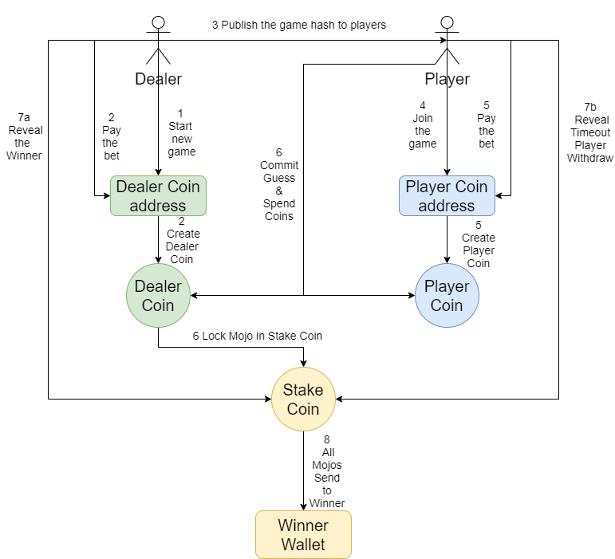

# Overview
This is a classic guess coin game (Heads or Tails) implemented by the Chialisp. It is an absolutely fair P2P game based on the Chia blockchain. You can play with anyone in the world without custody.

# Requirements
 - You need to run the game with a synced Chia full node (Wallet)
 - Python 3.7.5+
 - Some Mojos (XCH)

# Installation

    git clone https://github.com/ytx1991/ChiaHeadsOrTails.git
    cd ChiaHeadsOrTails
    pip install -r requirements.txt
# Configuration
Change the config.ini file before the play or I will get all your wins :D
> [GameSetting]

;The wallet address you want receive the reward Mojos

RewardPuzzleHash=0x59545e1cf881294a631dc96772cf64605e6f6943d4214a32e43c32aa02b7ec21

;A pair of BLS keys, it's not your wallet key. You can create a new Chia wallet and get a pair of keys. The keys must be unique.

SignPrivateKey=0x2423cdec6398dd75917827344e8f77c968521008578a9b06cddf309e119ee4d1

SignPublicKey=0xafc5afdd4f567c38138430dbd7e2c5f4a079602739e94625e94540f23bf0f91cb003388ece0044f437515dc7fae3f2d1

FreezeSeconds=302400

# How to play

1 Dealer of the game starts a new game. It will create a local key file and return a game hash.

> F:\Projects\ChiaHeadsOrTails>python game.py new

The mojos you bet for this game (1 XCH = 1000000000000 mojo): 100

You flipped the coin and saw it is (HEAD or TAIL): HEAD

PLEASE SAFELY KEEP THE 76c4d49d76722bae088a4bc12bb341be0225e9e307f4bb7104345e8a02efe61b.key FILE and FILE NAME, OTHERWISE YOU WILL LOSE!

Now, please transfer your bet 100 mojos to the dealer coin address xch1dvakrdefuhty9yytusda8qshxa3vttz5jmke3havsn46nmz4v4wqthc9e8.

You can track the transaction at https://chia.tt/info/address/xch1dvakrdefuhty9yytusda8qshxa3vttz5jmke3havsn46nmz4v4wqthc9e8

Send the game hash to your friends to start the game:

0x59545e1cf881294a631dc96772cf64605e6f6943d4214a32e43c32aa02b7ec21|100|0x76c4d49d76722bae088a4bc12bb341be0225e9e307f4bb7104345e8a02efe61b|100|0x6b3b61b729e5d642908be41bd382173762c5ac5496ed98dfac84eba9ec55655c

NOTE: As the dealer you need to reveal the winner in 100 seconds after the player committed the guess.

 2 Dealer pays the bet to the dealer coin address. You can use the chia UI client to do this. Remember the unit is Mojo not XCH. A new dealer coin will be created after the payment confirmed.
 3 Dealer publishing the game hash to the world. Anyone who know the game hash can join the game.
 4 Player inputs the game hash. It will return a player coin address

> F:\Projects\ChiaHeadsOrTails>python game.py play

Input the game hash you want to play: 0x59545e1cf881294a631dc96772cf64605e6f6943d4214a32e43c32aa02b7ec21|100|0x76c4d49d76722bae088a4bc12bb341be0225e9e307f4bb7104345e8a02efe61b|100|0x6b3b61b729e5d642908be41bd382173762c5ac5496ed98dfac84eba9ec55655c

This is a valid game.

Now you need to pay your bet 100 mojos to address xch1d4gq0dsgp9tgxqpk04mem7w43lnfuxr6cn4jlaexqtt4qwzn8gmsksharm before the guess.

You can track the transaction at https://chia.tt/info/address/xch1d4gq0dsgp9tgxqpk04mem7w43lnfuxr6cn4jlaexqtt4qwzn8gmsksharm

5 Player pays the bet to the player coin address. You can use the chia UI client to do this. Remember the unit is Mojo not XCH. A new playercoin will be created after the payment confirmed

6 Player makes a guess (HEAD or TAIL) and commit the game. No one can refund after the commit. Mojos from dealer & player coins will send to the stake coin.

> F:\Projects\ChiaHeadsOrTails>python game.py commit

Input the game hash you want to commit: 0x59545e1cf881294a631dc96772cf64605e6f6943d4214a32e43c32aa02b7ec21|100|0x76c4d49d76722bae088a4bc12bb341be0225e9e307f4bb7104345e8a02efe61b|100|0x6b3b61b729e5d642908be41bd382173762c5ac5496ed98dfac84eba9ec55655c

You guess the coin is (HEAD or TAIL): HEAD

{'status': 'SUCCESS', 'success': True}

The game is set. Wait the dealer reveal the winner. If the game is timeout you can claim all Mojos by the "timeout" command.

7a Dealer needs to reveal the winner before the timeout (set by the dealer). If the player guess is wrong then the dealer will win the game. All Mojos will send to the winner wallet address.

> F:\Projects\ChiaHeadsOrTails>python game.py reveal

Input the game hash you want to reveal: 0x59545e1cf881294a631dc96772cf64605e6f6943d4214a32e43c32aa02b7ec21|100|0x54910a2489aec3f015e4473129bdd47c052bced441a681ee05e4de225bd16752|302400|0xc8e4cf0346d30e1344bb05f32bc5eff28ca4ec6ad63a66aabce564b64a20f4eb

Reveal key is B2BBFFRA4S7KUC9N

Dealer coin 0010fcfe7a76e124ae3cb8b15ae005e1d8645e5e8f2d949313553a98f845b050 spent, revealing the winner ...

Player 0x59545e1cf881294a631dc96772cf64605e6f6943d4214a32e43c32aa02b7ec21 guessed the coin is TAIL

{'status': 'SUCCESS', 'success': True}

You win! 200 mojo will send to your address 0x59545e1cf881294a631dc96772cf64605e6f6943d4214a32e43c32aa02b7ec21.

7b Player can claim all Mojos if the dealer doesn't reveal the winner before the time out.

> F:\Projects\ChiaHeadsOrTails>python game.py timeout

Input the game hash you think it is timeout: 0x59545e1cf881294a631dc96772cf64605e6f6943d4214a32e43c32aa02b7ec21|100|0x76c4d49d76722bae088a4bc12bb341be0225e9e307f4bb7104345e8a02efe61b|100|0x6b3b61b729e5d642908be41bd382173762c5ac5496ed98dfac84eba9ec55655c

Trying to withdraw timeout game ...

Dealer coin f3dfb6b58150d3c6312f5ff969b308f73add15b49b384a083da5d2b82ddcd811 spent, revealing the winner ...

Player 0x59545e1cf881294a631dc96772cf64605e6f6943d4214a32e43c32aa02b7ec21 guessed the coin is HEAD

{'status': 'SUCCESS', 'success': True}

You win! 200 mojo will send to your address 0x59545e1cf881294a631dc96772cf64605e6f6943d4214a32e43c32aa02b7ec21.

# Q & A

## Can I refund my bet?
Sure, but only before the game set. You can use the "refund" command to do it.
## I don't have any Mojo, how to play?
You don't have to pay the bet by youself. As long as you get the coin address, you can ask you friends pay the bet for you.
## Why this is a fair game?
Everything is locked by the Chialisp. No one can cheat the blockchain. You  cannot refuse to acknowledge the winner or change the commit guess / fact.